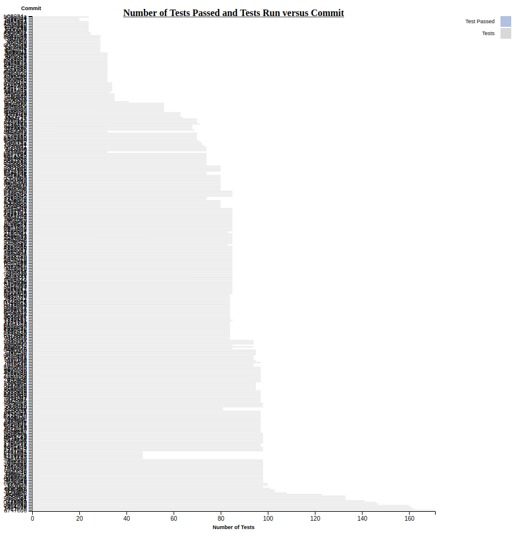
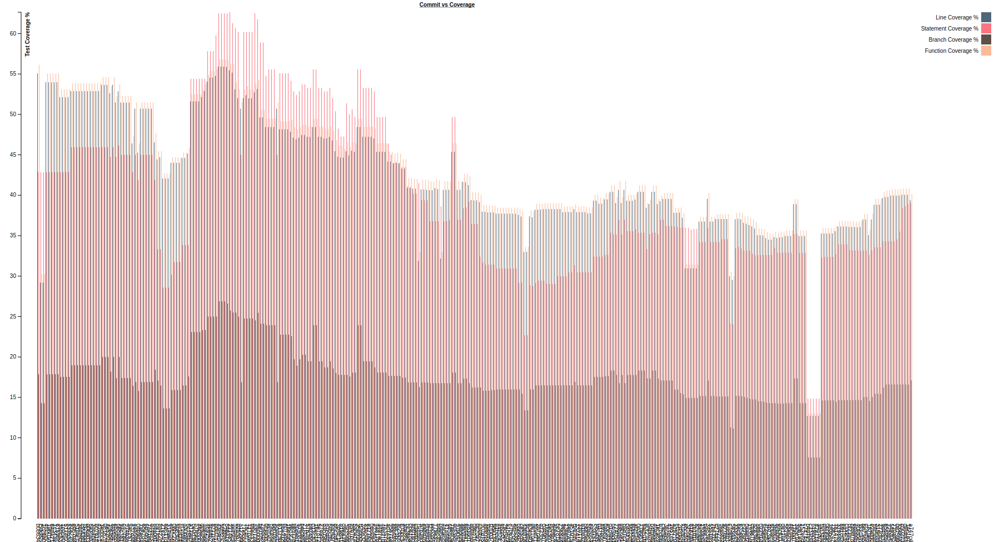
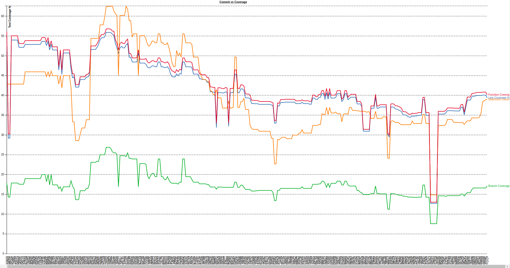
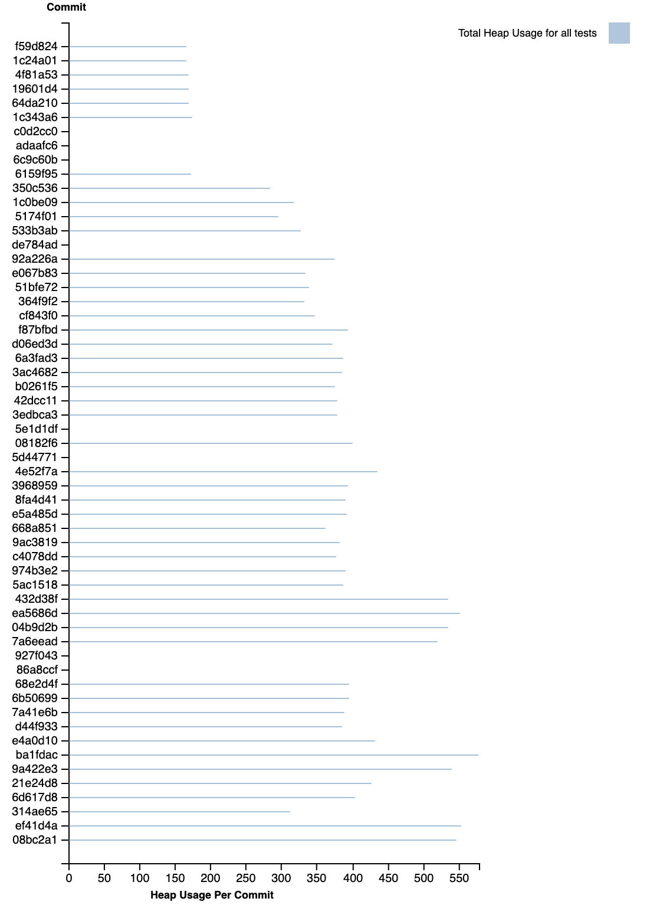
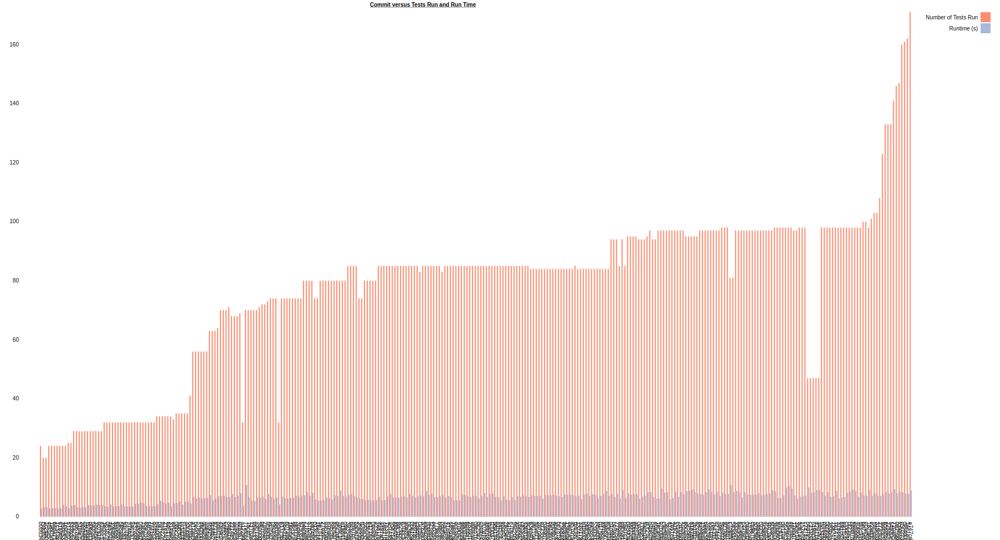

# test-percentage-visualizer

Summary: A visualizer tool to display testing related information per commits. The tool currently only works with JavaScript repos using Jest.

# Visualizer Setup & Tool Usage

1. Clone and cd into the repo
2. Run the command `./compute-testing-info <repo-path> [<subsample-freq>]`
3. If you do not have it, install Python 3 to your system
4. Once Python is installed, in a terminal run `python -m http.server 8000` (or another port of choice) to start a local http server
5. In a NEW terminal run `start <browser> http://localhost:<port>/<path_to_html_file>` on Windows, `open <browser> http://localhost:<port>/<path_to_html_file>` on MacOS, or `browser http://localhost:<port>/<path_to_html_file>` on Linux. For example, `start firefox http://localhost:8000/visualization/teststatus.html` will open the test status (pass/fail) visualization in Firefox on Windows
6. Interact with the visualization. Some features include tooltips when mousing over the bar graphs. This shows the values of each bar for more precision. The legend of some graphs are also
interactive, which would isolate certain bars.

##### NOTE: Since the libraries are called by the browser, you will need an active internet connection.

# Project Details

## Engineering Task

The engineering task our visualization supports is identifying commits that have an outsized impact on test performance. Impact could be positive or negative changes to test coverage, the number of tests passing, or memory consumption.

## The Intent of our Visualisation

The original task we set out to solve was to help facilitate the strenuous process of testing, making information more visual and informative to everyone. We wanted the tool to be able to keep track/log information throughout the lifetime of the repo, from the first commit to present day.

## The Original Design

The original visualization consisted of two graphs:

1. Line graph to output lines of code per commit, visualizing the percentage of test code compared to all lines of code
2. Bar graph to output number of passed tests compared to total number of tests over time

### The Outcome of Prototype Testing

The prototype testing concluded that the information was lackluster: programmers felt that the graphs weren't able to produce enough relevant information for them to care. If someone were to use the tool, it would not only have to produce more information as a whole, but more relevant information.

Also, we realized that if a repo had way too many commits, the graphs would be rendered useless since the plots and bars would be squished and small, and the details became undistinguishable.

So we scrapped the first analysis and visualization, modified the other and, collected more data about the performance of tests (how long to run a test suite, memory usage of a test suite, and coverage of a test suite) for more relevance. We also decided to provide the ability to subsample the repo over history (i.e. to skip every n commits).

## The New Design

The new visualization consists of the following graphs:

1. `teststatus.html`: A bar graph showing the number of passing tests and total number of tests for each commit. This is also an interactive graph with mouse tooltips.
2. `coverage-bar.html`: A bar graph showing each of the coverage types (line, statement, branch, and function) for each commit. This is also an interactive graph with mouse tooltips and legend function.
3. `coverage-line.html`: A coverage line graph of the same information as above, for easier legibility and a better representation of the repository as a whole.
4. `testruntime.html`: A bar graph showing the time taken to run the test suite and total number of tests for each commit. This is also an interactive graph with mouse tooltips and legend function.
5. `heap-usage.html`: A bar graph showing the total memory used (in MB of heap usage) on all unit tests per commit. This is also an interactive graph with mouse tooltips and a legend function.

### The Outcome of End-User Testing

The final design includes the following features:

- 5 distinct graphs displaying status of tests, coverage, runtime, and memory usage over the lifetime of the project repository
- An optional second argument passed to analyze every nth commit to display in the visualizations: `./compute-testing-info <repo-path> [<subsample-freq>]`
- The line graph displaying coverage was added as a result of feedback from user acceptance testing, to improve legibility over large numbers of commits
- Being able to hover the mouse over the bar graphs to give exact results is useful (seen in the User test video).
- User acceptance testing revealed that the number of passing tests/total number of tests and runtime of test suite/total number of tests graphs were helpful: users indicated that they could see if not enough tests were being added at certain milestones in the project lifetime, or if too many tests were being added at once, potentially impacting performance

## Sample Screenshots

### Test Status

### Coverage Bar Chart

### Coverage Line Chart

### Memory Usage Chart

### Test Runtime

